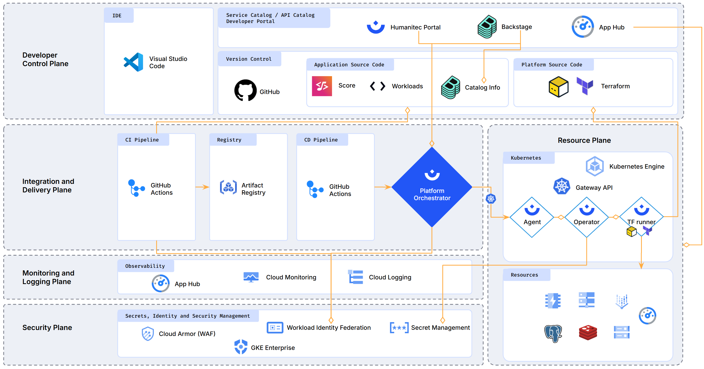

[](https://github.com/mathieu-benoit/humanitec-ref-arch/actions/workflows/ci.yaml)



Terraform Blueprint to deploy the Humanitec resources based on 5 different Terraform Modules:
- [Main Terraform Module](./modules/README.md)
- Google Cloud
  - [GKE(s) Terraform Module](./modules/gcp-cluster/README.md)
  - [App(s) Terraform Module](./modules/gcp-app/README.md)
- Humanitec
  - [Org level Terraform Module](./modules/htc-org/README.md)
  - [Cluster(s) level Terraform Module](./modules/htc-cluster/README.md)
  - [App(s) level Terraform Module](./modules/htc-app/README.md)

TOC:
- [Assumptions](#assumptions)
- [Deploy the Terraform Blueprint](#deploy-the-terraform-blueprint)
- [Test connectivity](#test-connectivity)
- [Update Developers's CD pipelines](#update-developerss-cd-pipelines)
- [Terraform Blueprint documentation](#terraform-blueprint-documentation)
- [Available resource types for the Developers in their Score files](#available-resource-types-for-the-developers-in-their-score-files)

# Assumptions

- GKE cluster provisioned in GCP as an input for the `cluster` Terraform Module.
- "Project" == "Humanitec App"
- 1 GKE cluster per Env Type
- 1 Humanitec Service User/Token per {App, Env Type}
- People as:
  - `Member` at the Org level
  - `Viewer` at the App Level
- Service User:
  - `Artefact Contributor` for Development and `Member` for other Environments at the Org level
  - `Developer` at the App Level
  - `Deployer` at the Env Type

# Deploy the Terraform Blueprint

```bash
export HUMANITEC_ORG=FIXME

humctl login

terraform workspace select -or-create=true ${HUMANITEC_ORG}

terraform init -upgrade

terraform plan \
    -var org_id=${HUMANITEC_ORG} \
    -var token=$(humctl config view | jq -r .token) \
    -var 'clusters=[{name="mabenoit-demo", region="northamerica-northeast1", project_id="mabenoit-demo-458522"}]' \
    -var humanitec_crds_already_installed=true \
    -out out.tfplan

terraform apply out.tfplan
```

# Test connectivity

```bash
humctl get resource-account

ACCOUNT_ID=FIXME

humctl resources check-account ${ACCOUNT_ID}

APP_ID=sail-sharp
ENV_ID=development
ENV_TYPE=development

humctl resources check-connectivity \
    --app ${APP_ID} \
    --env ${ENV_ID} \
    --env-type ${ENV_TYPE}
```

# Update Developers's CD pipelines

Update Developer's CD pipelines based on `outputs`:
```bash
terraform output service_users_tokens
```

You can also use this token locally (`HUMANITEC_TOKEN`) and run `humctl score deploy --app --env`

# Available resource types for the Developers in their Score files

```bash
humctl score available-resource-types
```

```none
Name                            Type            Category        Class
Environment                     environment     score           default
Service                         service         score           default
Persistent Volume               volume          datastore       default
Redis                           redis           datastore       default
DNS                             dns             dns             default
Route                           route           ingress         default
Google Cloud Storage Bucket     gcs             datastore       default
TLS certificate                 tls-cert        security        default
Postgres                        postgres        datastore       default
Google Cloud Vertex AI          gcp-vertex-ai                   default
```